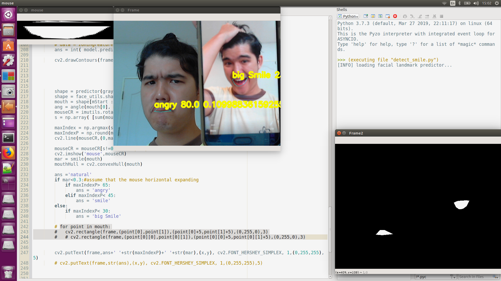

# smileDetection
smile detection of the video by Python

Multi facial mood detection based on the mouth for videos is proposed in this respitory.
There are five answers for the mouth namely, 'big smile', 'smile', 'natural', 'angry' and 'oh'.
A simple robust method is employed for this work.

## Purpose
At first, this work aim to detect facial smile by supervised learning approach. The [GENKI](https://inc.ucsd.edu/mplab/wordpress/index.html%3Fp=398.html) dataset was selected to use in this work. However, it seem frustration by the performance of the model and even worse when applied with the video (especially the video of me). I then seek for the method that more simple. Thanks to [Rishav Agarwal](https://www.freecodecamp.org/news/smilfie-auto-capture-selfies-by-detecting-a-smile-using-opencv-and-python-8c5cfb6ec197/?fbclid=IwAR3QPQW55TgE-IkXDUM1l8nZVTZYpGNuYe--Behtlc0h4VDH2xhdkQxrBME) who inspried me by the idea of measuring aspect ratio of the mouth then simply judge the smile by empirical threshold. 

## Idea
The mouth aspect ratio (MAR) can distinguish the natural mouth from the smiling mouth (which no teeth exposed) but, for the big smile (which teeth exposed) there aren't so difference. By the way, it still possible by include the vertical position of corners of the mouse to the criteria. This work then detecting smile by MAR and vertical position of corners of the mouse.

## Method
* First, we need to detect the face. Thank to (Adrian)[https://www.pyimagesearch.com/2017/04/24/eye-blink-detection-opencv-python-dlib/] for awersome library.
* Fill the mouse area with the white and other area with the black.
* Rotate the detected mouth to make its parallel to the horizontal line.
* Determine the position of horizontal line that drawed between two corners of the mouth.
* Set thresholds for distinguish the state of the mouse. 

## Suggestion
* I don't think manualy thresholding features is the best idea. It would better to use the model for example, decision tree to define the  appropriate threshold. However, a good data set is required for such predictive model.
* The proposed method does not work well for looked up/down face.
* I need more face for evaluating performance of the method.

